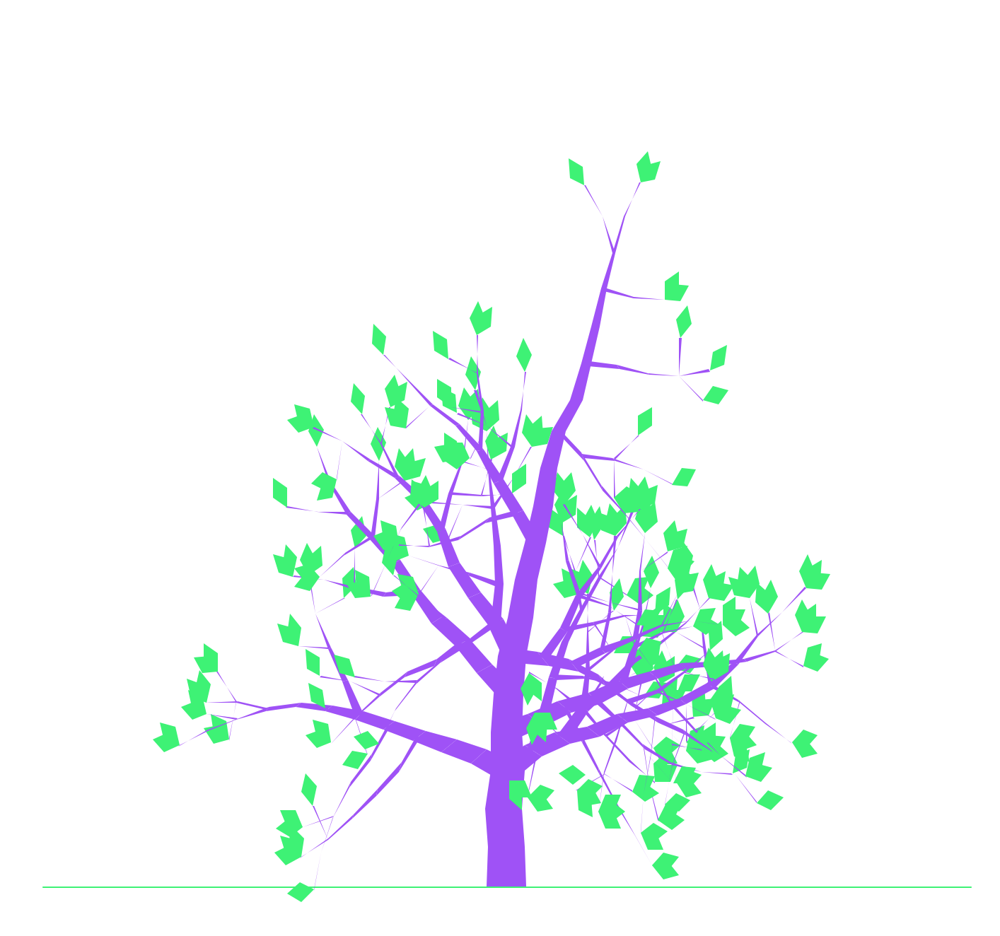
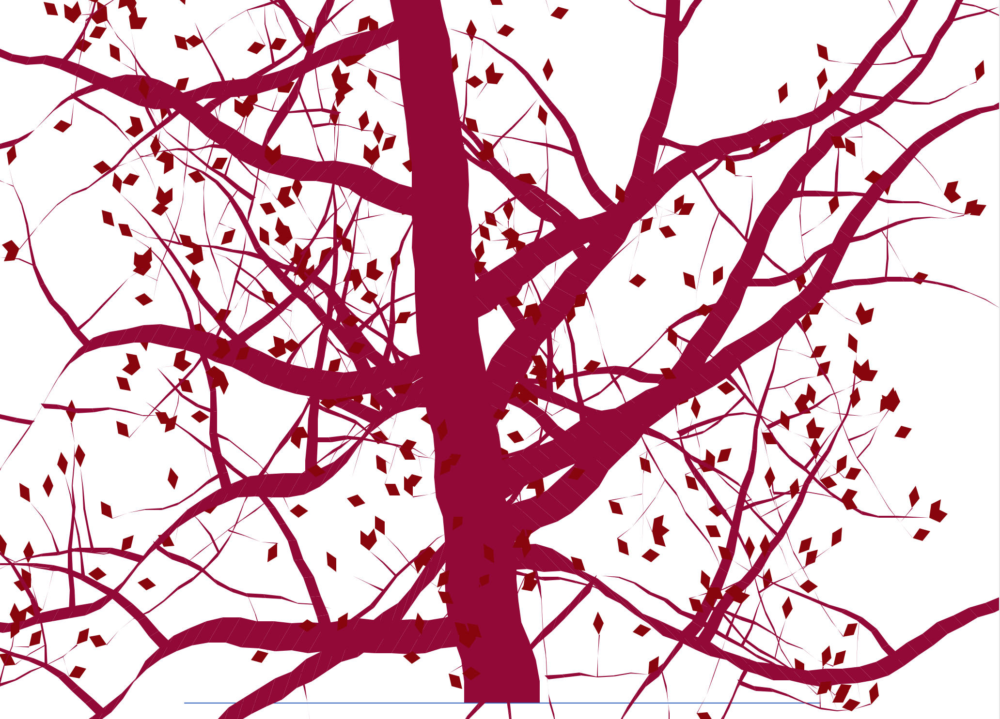
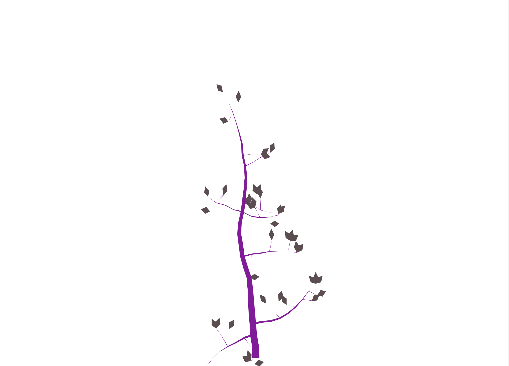

# Tree.py
Tree.py is a program that uses recursion to randomly generate a tree, with all the properties randomized, giving a unique tree every time. They might not always be pretty, but they're unique and special :)

## Examples

